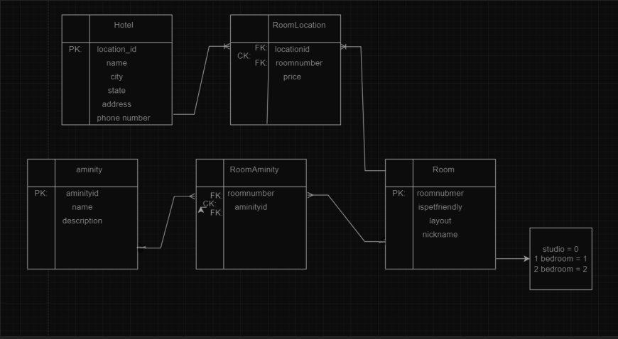
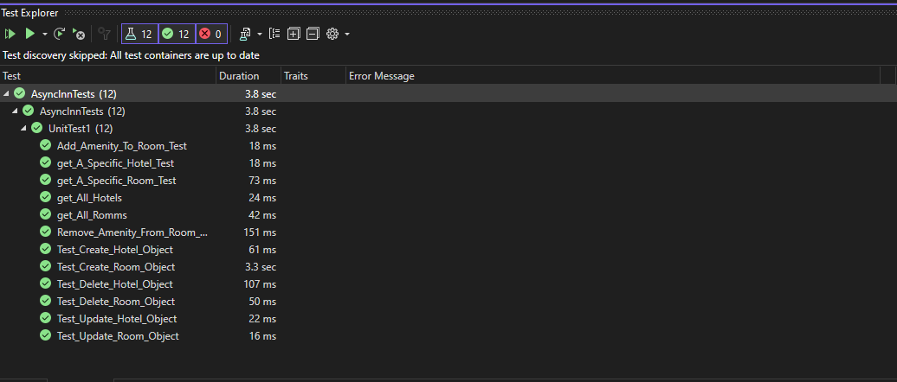
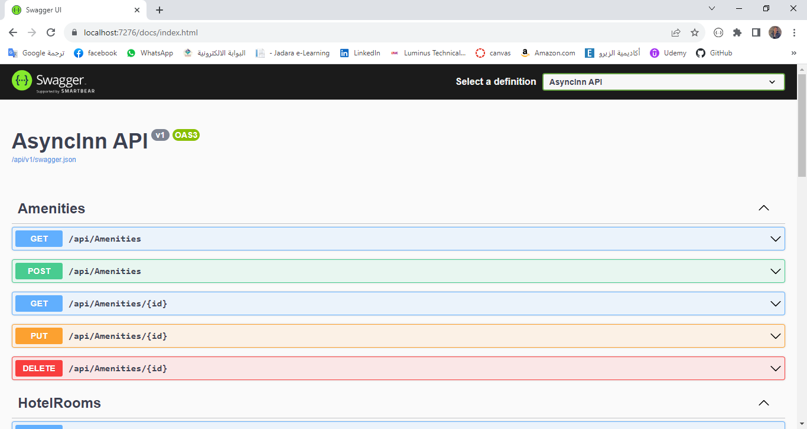

# Async-Inn

**Name:** Mhamad Belal yusef Al Msalma

**Today’s date:**  07/17/2023

## ERD diagram



## textual representation of the ERD diagram

Here's a textual representation of the ERD diagram for the Async Inn hotel chain:


Table: Hotel
- LocationID (Primary Key)
- Name
- City
- State
- Address
- PhoneNumber

Table: RoomLocation
- LocationID (Foreign Key to Location)
- RoomNumber (Foreign Key to Room)
- (Composite Primary Key)
- price

Table: Amenity
- AmenityID (Primary Key)
- Name
- Description

Table: Room
- RoomNumber (Primary Key)
- layout
- Nickname
- IsPetFriendly
- Enm {studio=0 , one_bedroom = 1, two_bedroom=3}

Table: RoomAmenity
- RoomNumber (Foreign Key to Room)
- AmenityID (Foreign Key to Amenity)
- (Composite Primary Key)


## Explanation of the components in the ERD diagram:

Here's the explanation of the components in the updated ERD diagram for the Async Inn hotel chain:

Table: Hotel

- The Hotel table represents the hotel locations and stores information such as the location ID, name, city, state, address, and phone number.
- The LocationID is the primary key of the Hotel table, uniquely identifying each hotel location.

Table: RoomLocation

- The RoomLocation table represents the relationship between hotels and rooms.
- It stores the LocationID and RoomNumber, forming a composite primary key, to associate rooms with each hotel location.
- The price attribute in the RoomLocation table represents the price of the room at a specific hotel location.

Table: Amenity

- The Amenity table represents the amenities available in the rooms.
- It stores information such as the AmenityID, name, and description.
- The AmenityID is the primary key of the Amenity table, uniquely identifying each amenity.

Table: Room

- The Room table represents individual rooms in the hotel and stores information such as the room number, layout, nickname, and pet-friendliness.
- The RoomNumber is the primary key of the Room table, uniquely identifying each room.
- The layout attribute represents the type of room layout (e.g., studio, one-bedroom, two-bedroom).
- The nickname attribute represents a customized name given to each room.
- The IsPetFriendly attribute indicates whether the room is pet-friendly or not.
- The Enm attribute represents an enum for the different room layouts, with values corresponding to the respective layouts (0 for studio, 1 for one-bedroom, 2 for two-bedroom).

Table: RoomAmenity

- The RoomAmenity table is a join table that represents the relationship between rooms and amenities.
- It stores the RoomNumber and AmenityID, forming a composite primary key, to associate amenities with each room.


In this ERD diagram, we have identified primary keys, foreign keys, composite keys, and the relationships between tables. The Hotel table has a one-to-many relationship with the RoomLocation table (one hotel can have multiple room locations), and the Room table has a one-to-many relationship with the RoomAmenity table (one room can have multiple amenities). Additionally, the Hotel table has a one-to-many relationship with the RoomLocation table through the LocationID.

---

## Introduction to your web app

The Async Inn Hotel Asset Management System is a web-based API that assists Async Inn, a local hotel chain, in efficiently managing their hotel assets at various locations. The project's primary goal is to create a RESTful API server, enabling the management of rooms, amenities, and the addition of new hotel locations. The system utilizes a relational database to store and ensure data integrity.

## Relations between tables

**Hotel table:**

* LocationID (Primary Key) uniquely identifies each hotel.
* Each hotel has a Name, City, State, Address, and PhoneNumber.

**RoomLocation table:**

* The LocationID (Foreign Key to Location) links to the Hotel table, indicating which hotel the room is in.
* The RoomNumber (Foreign Key to Room) links to the Room table, indicating the specific room within the hotel.
* The combination of LocationID and RoomNumber forms a Composite Primary Key, ensuring uniqueness.
* The price column represents the price of that particular room at the given location.

**Amenity table:**

* AmenityID (Primary Key) uniquely identifies each amenity.
* Each amenity has a Name and Description.

**Room table:**

* RoomNumber (Primary Key) uniquely identifies each room within the system.
* The layout column may store information about the room's physical layout (e.g., single, double, suite).
* The Nickname column might be used to give the room a custom name.
* The IsPetFriendly column indicates whether the room is pet-friendly or not.
* The Enm column appears to represent an enumeration, with values 0, 1, or 3, corresponding to different room types (e.g., studio, one-bedroom, two-bedroom).

**RoomAmenity table:**

* The RoomNumber (Foreign Key to Room) links to the Room table, specifying which room the amenity is associated with.
* The AmenityID (Foreign Key to Amenity) links to the Amenity table, specifying which amenity is associated with the room.
* The combination of RoomNumber and AmenityID forms a Composite Primary Key, ensuring uniqueness.

---

## Repository Design Pattern in Hotel Management Application

### Architecture Pattern: Repository Design Pattern

The Repository Design Pattern is a widely used architectural pattern that helps in separating the business logic from the data access layer in an application. It provides an abstraction layer between the application and the data source (e.g., a database or an external service), allowing the application to interact with data without having to know the underlying implementation details. The pattern promotes a clean and maintainable codebase by organizing data access operations in a central repository.

### How it is used in the Hotel Management Application:

In the Hotel Management Application, the Repository Design Pattern is employed to handle the data access operations for entities such as Hotel, Amenity, and Room. The pattern is implemented using the IbaseRepo interface, which contains the CRUD (Create, GetAll, GetbyId, Update, Delete) operations that all repositories for different entities must implement. Each entity (Hotel, Amenity, and Room) has its own repository class that implements the IbaseRepo interface, providing specific implementations for interacting with the data source.

---

## Lab14

### RoomAmenities
1. Add onto your RoomsController the ability to add and remove amenities to a specific room
 * Routes: POST/DELETE: [Route("{roomId}/Amenity/{amenityId}")]
 * Add to your IRoom Interface the method signatures to AddAmenityToRoom(int roomId, int amenityId) and RemoveAmentityFromRoom(int roomId, int amenityId)
 * Add the logic for the above methods into your RoomRepository.cs Service.
2. Add to your Room.cs, Amenity.cs, and RoomAmenity.cs file the navigation properties that we defined in your ERD.
3. On the Get() based call in your RoomRepository.cs and your ‘AmenityRepository.cs file, use the Include()` to populate the navigation property details within the return object.

### HotelRoom
1. Create a new interface named IHotelRoom that contains basic CRUD operations for manipulating a HotelRoom.
2. Create a service named HotelRoomRepository that implements the IHotelRoom interface. Add the logic for each of the methods to satisfy the CRUD operations on a HotelRoom.
3. Scaffold out a new HotelRoomController that will inject the IHotelRoomInterface. Update/customize the logic to use the interface instead of the DBContext
4. Modify the routes of this controller for the following:
  * GET all the rooms for a hotel: /api/Hotels/{hotelId}/Rooms
  * POST to add a room to a hotel: /api/Hotels/{hotelId}/Rooms
  * GET all room details for a specific room: /api/Hotels/{hotelId}/Rooms/{roomNumber}
  * PUT update the details of a specific room: /api/Hotels/{hotelId}/Rooms/{roomNumber}
  * DELETE a specific room from a hotel: /api/Hotels/{hotelId}/Rooms/{roomNumber}

---

## Lab16

Add onto your current Async Inn application by cleaning up input and outputs of your controllers to be DTOs.

DTOs: DTOs stand for data transfer objects

Amenities,
Rooms
HotelRooms
Hotels

```shell
    public class HotelDTO
    {
        public int ID { get; set; }
        public string Name { get; set; }
        public string StreetAddress { get; set; }
        public string City { get; set; }
        public string State { get; set; }
        public string Phone { get; set; }
        public List<HotelRoomDTO> Rooms { get; set; }
    }


    public class HotelRoomDTO
    {
        public int HotelID { get; set; }
        public int RoomNumber { get; set; }
        public decimal Rate { get; set; }
        public bool PetFriendly { get; set; }
        public int RoomID { get; set; }
        public RoomDTO Room { get; set; }
    }

    public class RoomDTO
    {
        public int ID { get; set; }
        public string Name { get; set; }
        public string Layout { get; set; }
        public List<AmenityDTO> Amenities { get; set; }
    }

    public class AmenityDTO
    {
        public int ID { get; set; }
        public string Name { get; set; }
    }
```


In HotelsController, the get method should return:

```shell
{
    "id": 1,
    "name": "My really cool Hotel",
    "streetAddress": "123 CandyCane Lane",
    "city": "Seattle",
    "state": "WA",
    "phone": "123-456-8798",
    "rooms": [
        {
            "hotelID": 1,
            "roomNumber": 101,
            "rate": 75.00,
            "petFriendly": false,
            "roomID": 2,
            "room": {
                "id": 2,
                "name": "Queen Suite",
                "layout": "TwoBedroom",
                "amenities": [
                    {
                        "id": 1,
                        "name": "Coffee Maker"
                    },
                    {
                        "id": 2,
                        "name": "Mini Bar"
                    }
                ]
            }
        },
        {
            "hotelID": 1,
            "roomNumber": 123,
            "rate": 120.00,
            "petFriendly": true,
            "roomID": 1,
            "room": {
                "id": 1,
                "name": "Princess Suite",
                "layout": "OneBedroom",
                "amenities": [
                    {
                        "id": 1,
                        "name": "Coffee Maker"
                    },
                    {
                        "id": 2,
                        "name": "Mini Bar"
                    }
                ]
            }
        }
    ]
}
```


In HotelRoomsController, the get method should return:

```shell
{
    "hotelID": 1,
    "roomNumber": 101,
    "rate": 75.00,
    "petFriendly": false,
    "roomID": 2,
    "room": {
        "id": 2,
        "name": "Queen Suite",
        "layout": "TwoBedroom",
        "amenities": [
            {
                "id": 1,
                "name": "Coffee Maker"
            },
            {
                "id": 2,
                "name": "Mini Bar"
            }
        ]
    }
}
```


In RoomsController, the get method should return:

```shell
{
    "id": 1,
    "name": "Princess Suite",
    "layout": "OneBedroom",
    "amenities": [
        {
            "id": 1,
            "name": "Coffee Maker"
        },
        {
            "id": 2,
            "name": "Mini Bar"
        }
    ]
}
```

In AmenitiesController, the get method should return:

```shell
{
    "id": 1,
    "name": "Coffee Maker"
}
```

---

## Lab17

In this lab, I have implemented Xunit testing for my services and controllers, added Swagger documentation for my API, and provided ///summary documentation for all interfaces and services. Xunit testing is a unit testing framework that helps ensure different parts of my code work as expected. Swagger is a tool that generates API documentation, making it easier for me and other developers to understand and consume my API. The ///summary documentation is used to describe the purpose and functionality of interfaces and services in my code, making it more understandable for me and my team.


Unit Testing for the Services:



Swagger Documentation:




### Step-by-Step Directions (Happy Path):

1. Xunit Testing for Services and Controllers
2. Adding Swagger Documentation
3. Adding ///summary Documentation


### Other Relevant Details:

* It's essential to ensure that my Xunit tests cover various scenarios, including both positive and negative cases. This will help me catch potential bugs and ensure my code behaves as expected in different situations.
* For Swagger documentation, I can customize the generated output further by using XML comments in my code. These comments allow me to provide additional descriptions for my API endpoints, making the documentation even more helpful for me and my team.
* The ///summary documentation is not just for Swagger but is also useful for providing context to other developers who might work on the project in the future. It serves as a useful reference to understand the purpose and usage of different parts of my codebase.
